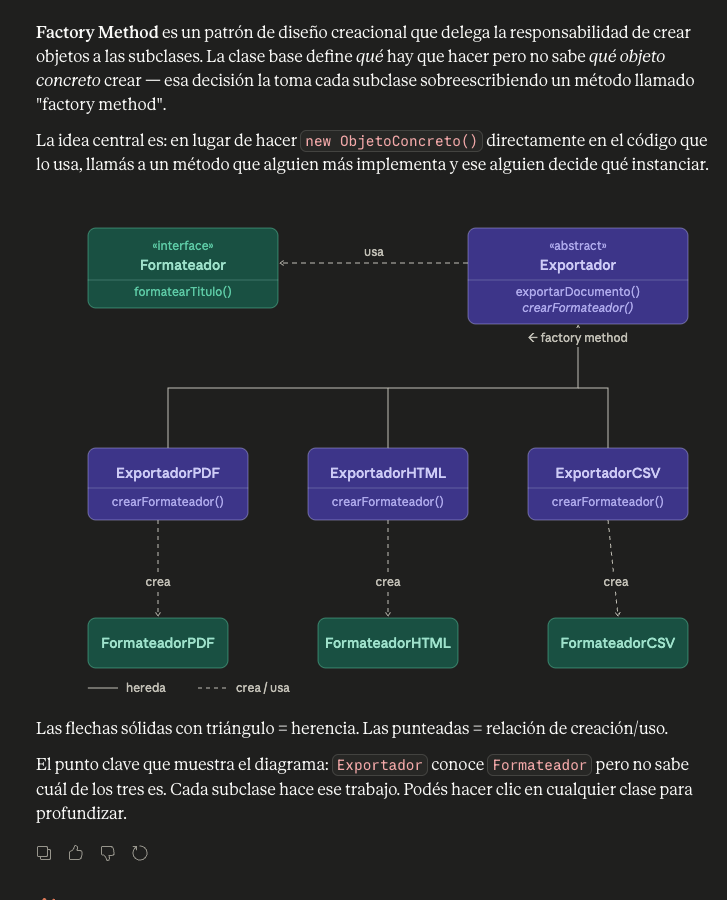
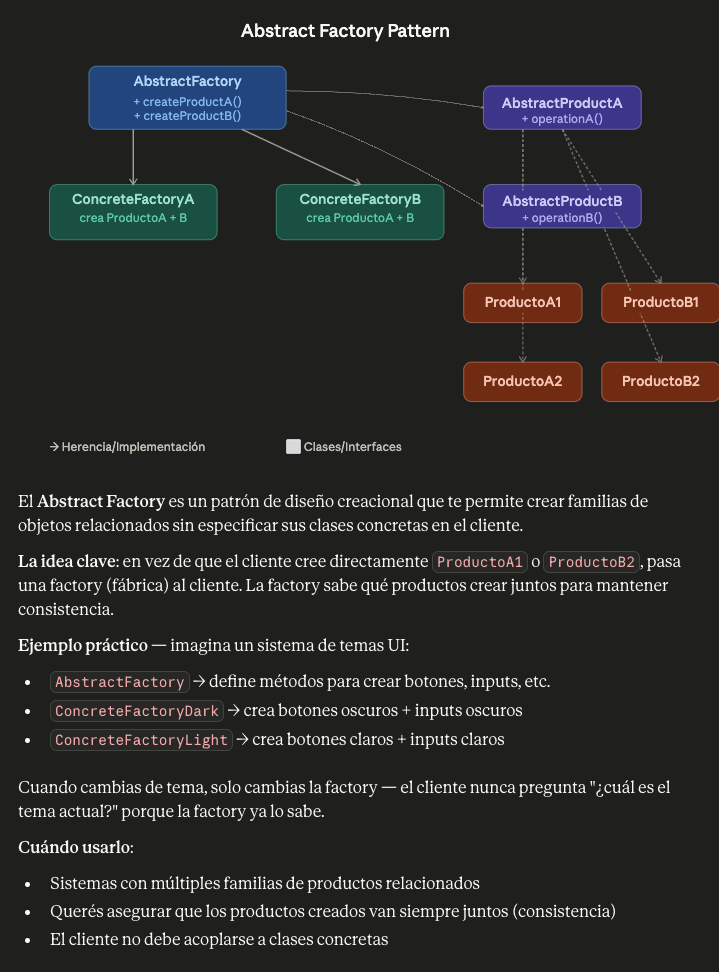
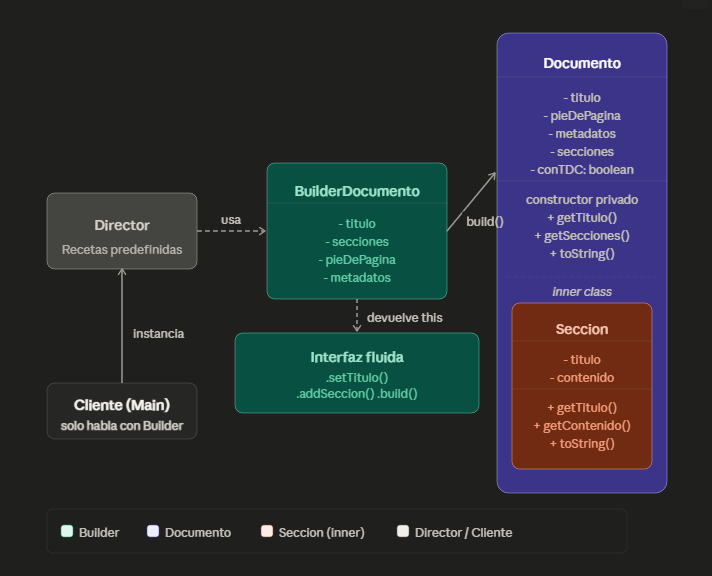
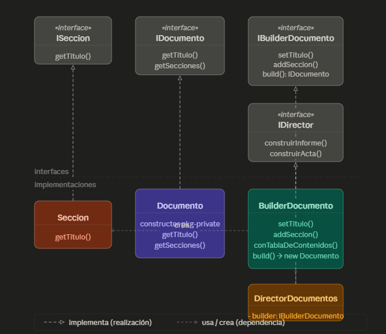

<h1>Singleton</h1>

Singleton — Gestor de configuración global. Implementar una clase
ConfiguracionApp que garantice una única instancia durante toda la ejecución.
Analizar por qué la implementación naïve no es thread-safe y corregirla usando
inicialización diferida con doble verificación. Discutir cuándo Singleton es un
antipatrón y cuándo es legítimo.

Cuándo Singleton es legítimo:

Configuración global de la aplicación
Pool de conexiones a base de datos
Logger centralizado
Caché en memoria compartida

Cuándo es un antipatrón:

Cuando lo usás para evitar pasar dependencias correctamente (es estado global disfrazado)
Cuando dificulta el testing porque no podés reemplazarlo por un mock
Cuando hay múltiples contextos de ejecución (múltiples classloaders, microservicios) donde la 
"única instancia" deja de serlo
Cuando el objeto no tiene razón real de ser único y lo forzás por comodidad

2.	Factory Method — Exportadores de documentos. Modelar una jerarquía de
exportadores (ExportadorPDF, ExportadorHTML, ExportadorMarkdown).
La clase base Exportador declara el factory method crearFormateador().
Cada subclase lo sobreescribe para instanciar el formateador correcto.
Agregar un nuevo formato sin modificar el código cliente.

<h1>Factory Method</h1>

<h1>Abstract Factory Method</h1>
Diferencia clave con Factory Method: Factory Method delega la creación de un solo producto. 
Abstract Factory delega la creación de una familia entera de productos relacionados, 
garantizando que todos son coherentes entre sí — no podés mezclar accidentalmente un 
BotonClaro con un PanelOscuro.

<h1>Builder con Inner Class</h1>
Documento es el contenedor grande porque BuilderDocumento y Seccion viven adentro como 
clases internas — por eso ocupan espacio físico dentro de su rect. 
El build() crea una instancia de Documento pasándose a sí mismo (new Documento(this)), 
y la clave de la interfaz fluida es que cada setter retorna this, lo que permite encadenar llamadas. 
El Director solo habla con Builder, nunca toca Documento directamente. Y el Cliente (Main) instancia 
el Builder y es el único que lo opera.

<h1>Builder con interfaces</h1>
El patrón define 4 interfaces
(ISeccion, IDocumento, IBuilderDocumento, IDirector) que son los contratos del sistema.
El patrón define 4 interfaces (ISeccion, IDocumento, IBuilderDocumento, IDirector) que son los 
contratos del sistema. Seccion y Documento son los productos: Seccion representa una parte del 
documento, y Documento tiene constructor package-private para que solo el Builder pueda instanciarlo.
BuilderDocumento acumula los campos opcionalmente y con cada setter retorna this, habilitando el 
encadenamiento fluido; al final build() valida y construye el Documento. DirectorDocumentos recibe 
un IBuilderDocumento por constructor y encapsula recetas predefinidas (informe ejecutivo, acta de 
reunión) sin saber cómo se ensambla internamente. El Main solo habla con interfaces, nunca con 
clases concretas, lo que permite reemplazar cualquier implementación sin tocar el resto.
